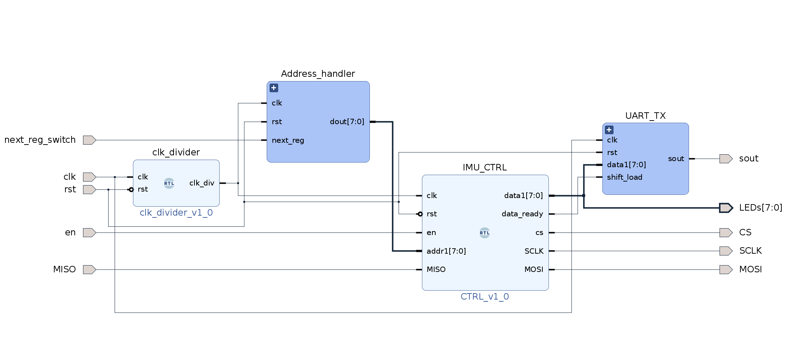

# IMU data visualizer (IMU <> SPI > UART)	

This project shows how to configure the IMU ICM20948 using SPI and visualize its data using UART.

The main block design is in the following figure:

- Address handler is a unit to change the IMU addresses (WHO AM I, GYRO_XOUT_L, etc.).
- IMU control is an FSM to wake up the IMU by writing to address x"06" the value of x"00". It also takes the addresses from the Address handler and sends it to the IMU.
- UART_TX is to send the received IMU to the serial port. The data is also visualized in 8 LEDs.
- next_reg_switch is an extra feature to toggle between the addresses (it increases a counter that is connected with a LUT of some IMU addresses). 
