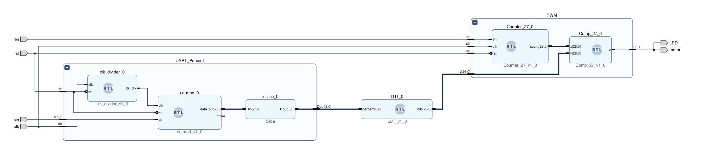

# UART to PWM/Motor control	

This project shows how to control the illumination of an LED using data coming from the UART using PWM signal.  

PWM frequency is **50Hz**

Keys:

0 means duty cycle = 0% 

1 means duty cycle = 10%

etc.

A= 1ms duty cycle (ARM)

B=1.1 ms (increase speed)

...

F= (max)

Any key= motor calibration. 

